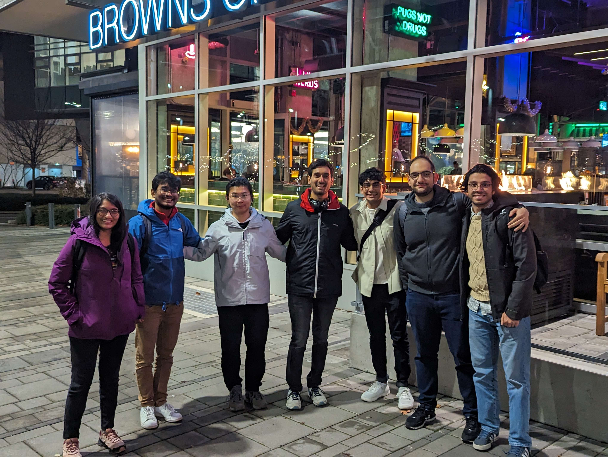

## Principled Systems Security Group

### Current

- [Rut Vora](https://rutvora.com/) (MSc)
- [Yayu Wang](https://st-saint.github.io/) (MSc)
- [Praveen Gupta](https://pvgupta24.github.io/) (MSc, co-advised with [Mohammad Shahrad](https://mshahrad.github.io/))
- [Arshia Moghimi](https://www.linkedin.com/in/arshia-moghimi-3a7a41150/) (MSc, co-advised with [Mohammad Shahard](https://mshahrad.github.io/))
- [Devam Sisodraker](https://github.com/TheD3vel0per) (UG Hons Thesis)
- [Amir Sabzi](https://amir-sabzi.github.io/) (MSc, 2021-2023, co-advised with [Mathias Lécuyer](https://mathias.lecuyer.me/)) → Research staff member @ UBC

<!--
- [Gargi Mitra](https://gargi-mitra.github.io/website/) (Postdoc, with [Karthik Pattabiraman](https://blogs.ubc.ca/karthik/))
-->

### Past

- Tanya Prasad (MITACS Intern 2022 and UG Hons. Thesis, BITS Pilani, 2022 - 2023) → UBC MSc
- Aanandi Siddharth (UG research, 2022)
- Kasra Kamal (UG Honors Thesis, 2022, received [Rick Sample Memorial Award in CS](https://www.cs.ubc.ca/award/2022/05/rick-sample-memorial-award-computer-science)) → Microsoft
- Gokce Dilek (UG research, 2022)
- Jae Han (Ryan) Kim (UG research, 2022)
- Nichole Boufford (UG research, 2021) → UBC MSc
- Chenhao Xu (UG research, 2021)
- Gwangkul (David) Kim (UG research, 2021)
- Rowan Lindsay (UG research, 2021)
- Ming Cheng Jiang (UG research, 2021)

