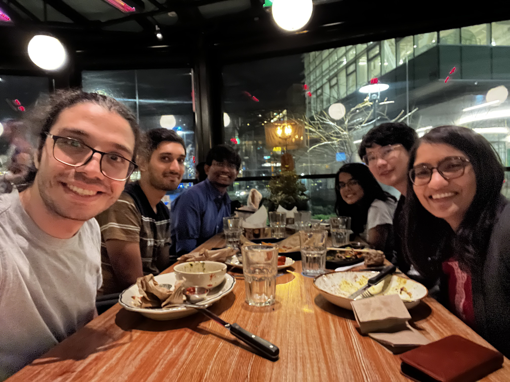

## Principled Systems Security Group

### Graduate students

- [Yayu Wang](https://st-saint.github.io/), PhD, 2025-
- [Angela DeMarco](), MSc, 2024-, (co-advised with [Joanna McGrenere](https://www.cs.ubc.ca/~joanna/))
- [Kjell Dankert](), MSc, 2024-, (recipient of DAAD scholarship)
- [Satvik Vemuganti](), PhD-track, 2024-

### Postdoc

- [Gargi Mitra](https://www.linkedin.com/in/gargimitraiitm/) (co-supervised with <a href="https://blogs.ubc.ca/karthik/">Karthik Pattabiraman</a>)

### Undergraduate students
- [Aidan Shields](https://www.linkedin.com/in/aidanshields18/), UG Honors Thesis, 2025
- [Arun Balamurali](https://www.linkedin.com/in/itsarune/), UG Honors Thesis, 2025
- [Alain Zhiyanov](https://www.linkedin.com/in/alainzhiyanov/), UG research, 2024

<!--
- [Gargi Mitra](https://gargi-mitra.github.io/website/) (Postdoc, with [Karthik Pattabiraman](https://blogs.ubc.ca/karthik/))
-->

### Group Alumni

<!--
-->
- [Rut Vora](https://rutvora.com/), (MSc, 2022-2025) → Arista Networks
- [Praveen Gupta](https://pvgupta24.github.io/), (MSc, 2022-2024, co-advised with [Mohammad Shahrad](https://mshahrad.github.io/))
- [Arshia Moghimi](https://www.linkedin.com/in/arshia-moghimi-3a7a41150/) (MSc, 2022-2024, co-advised with [Mohammad Shahard](https://mshahrad.github.io/)) → DevOps Engineer at Stealth
- Alice Kang, UG research, 2024
- Eric Daigle, UG research, 2024
- Lucas Qin, UG research, 2024
- Marcus Lai, UG research, 2024
- Ngoc Bui, UG research, 2024
- [Devam Sisodraker](https://www.linkedin.com/in/d3vel0per/), UG Hons Thesis, 2024
- [Amir Sabzi](https://amir-sabzi.github.io/), MSc, 2021-2023 (co-advised with [Mathias Lécuyer](https://mathias.lecuyer.me/)) → Research staff @ UBC (2023-2024) → Deloitte Management Services
- Tanya Prasad, MITACS Intern 2022 and UG Hons. Thesis, BITS Pilani, 2022-2023 → UBC MSc
- Kasra Kamal, [UG Honors Thesis](https://open.library.ubc.ca/soa/cIRcle/collections/undergraduateresearch/52966/items/1.0413167), 2022 (received [Rick Sample Memorial Award in CS](https://www.cs.ubc.ca/award/2022/05/rick-sample-memorial-award-computer-science)) → Microsoft
<!--- Aanandi Siddharth (UG research, 2022)-->
<!--- Gokce Dilek (UG research, 2022)-->
<!--- Jae Han (Ryan) Kim (UG research, 2022)-->
<!--- Gwangkul (David) Kim (UG research, 2021)-->
<!--- Chenhao Xu (UG research, 2021)-->
- Nichole Boufford, UG research, 2021 → UBC MSc
- Rowan Lindsay, UG research, 2021
- Ming Cheng Jiang, UG research, 2021

### Team photos

#### Summer 2024

#### Fall 2023

#### Winter 2023

