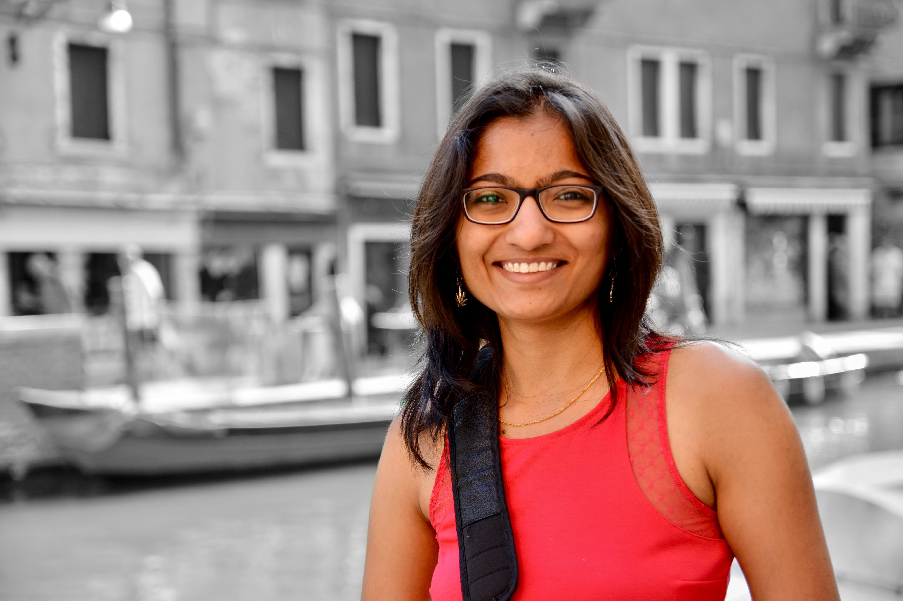

<!-- ### Aastha Mehta -->

<section id="banner">
  

  <!--
## About
  -->

  <header>
  <h1>Hi, I'm Aastha Mehta</h1>
  </header>
  
<mark style="background-color:yellow"><b>I am looking for PhD students to join my group at UBC!</b></mark>

  
<b>Students with an interest and background in systems and/or security, please apply <a href="https://www.cs.ubc.ca/students/grad/admissions">here</a>.</b>

  
I am a Tenure-Track Assistant Professor in the <a href="https://www.cs.ubc.ca/">CS Department, University of British Columbia</a>.
  I am affiliated with the <a href="https://systopia.cs.ubc.ca">Systopia Lab</a> and the <a href="https://spg.cs.ubc.ca/">Security and Privacy Group</a>.
  

  
I am broadly interested in systems security, data privacy, operating systems, networking, and distributed systems. My current research focuses on building principled systems for ensuring data security and privacy in cloud and edge platforms. I look at improving the security of both existing applications as well as emerging applications.

  <!--
  
I am broadly interested in systems security, data privacy, operating systems, networking, and distributed systems. I have worked on building <a href="http://thoth.mpi-sws.org/">systems</a> that enable online services to comply with data privacy and usage policies, and prevent accidental disclosures due to bugs and misconfigurations. More recently, I have been working on solutions to ensure privacy in Cloud services in the face of side-channel disclosures. Currently, I am also exploring systems for effective contact tracing and epidemic risk notification in the context of COVID-19.

  -->

  <!--
  
<b>Past:</b> I completed my PhD with <a href="http://www.mpi-sws.org/~druschel/">Peter Druschel</a> and <a href="http://www.mpi-sws.org/~dg/">Deepak Garg</a> from <a href="http://www.mpi-sws.org/">Max Planck Institute for Software Systems (MPI-SWS)</a>. Before my PhD, I worked at NetApp, Bengaluru (India), and completed my Bachelors in Computer Science from Birla Institute of Technology and Science (BITS) Pilani (India).

  -->

  

  
  
  
</section>

<!--
## Publications
To know more about our research, visit our [group web page](https://aasthakm.github.io/research/projects.html).

- Reconciling Security and Utility in Next Generation Epidemic Risk Mitigation System [\[PDF\]](https://arxiv.org/pdf/2011.08069.pdf) 
Pierfrancesco Ingo, Nichole Boufford, Ming Cheng Jiang, Rowan Lindsay, Roberta De Viti, Matthew Lentz, Gilles Barthe, Manuel Gomez-Rodriguez, Bernhard Schölkopf, Deepak Garg, Peter Druschel, **Aastha Mehta** 
Arxiv 2022. 
-->
<!-- *Authors listed in alphabetical order -->

<!--
- Pacer: Network Side-Channel Mitigation in the Cloud [\[PDF\]](https://aasthakm.github.io/files/sec22-pacer.pdf) [\[Tech Report\]](https://arxiv.org/pdf/1908.11568.pdf) [\[Code\]](https://gitlab.mpi-sws.org/pacer) 
**Aastha Mehta**, Mohamed Alzayat, Roberta De Viti, Björn B. Brandenburg, Peter Druschel, Deepak Garg 
USENIX Security Symposium, 2022.

- Listening to Bluetooth Beacons for Epidemic Risk Mitigation* [\[PDF\]](https://www.nature.com/articles/s41598-022-09440-1.pdf) 
Gilles Barthe, Roberta De Viti, Peter Druschel, Deepak Garg, Manuel Gomez-Rodriguez, Pierfrancesco Ingo, Heiner Kremer, Matthew Lentz, Lars Lorch, **Aastha Mehta**, Bernhard Schölkopf 
Scientific Reports. 2022. 
*Authors listed in alphabetical order

- PanCast: Listening to Bluetooth Beacons for Epidemic Risk Mitigation* [\[PDF\]](https://arxiv.org/pdf/2011.08069.pdf) 
Gilles Barthe, Roberta De Viti, Peter Druschel, Deepak Garg, Manuel Gomez-Rodriguez, Pierfrancesco Ingo, Matthew Lentz, **Aastha Mehta**, Bernhard Schölkopf 
White Paper, 2020. 
*Authors listed in alphabetical order

- Ensuring Compliance with Data Privacy and Usage Policies in Online Services [\[PDF\]](https://aasthakm.github.io/files/AasthaMehta-PhDThesis-2020.pdf) 
**Aastha Mehta** 
PhD Thesis, 2020.
-->
<!-- http://dx.doi.org/10.22028/D291-32673 -->

<!--
- Qapla: Policy compliance for database-backed systems [\[PDF\]](https://aasthakm.github.io/files/sec17-qapla.pdf) [\[Code\]](https://github.com/aasthakm/qapla) 
**Aastha Mehta**, Eslam Elnikety, Katura Harvey, Deepak Garg, Peter Druschel 
USENIX Security Symposium, 2017.

- Thoth: Comprehensive Policy Compliance in Data Retrieval Systems [\[PDF\]](https://aasthakm.github.io/files/sec16-thoth.pdf) 
Eslam Elnikety, **Aastha Mehta**, Anjo Vahldiek-Oberwagner, Deepak Garg, Peter Druschel 
USENIX Security Symposium, 2016.

- Oblivious Multi-Party Machine Learning on Trusted Processors [\[PDF\]](https://aasthakm.github.io/files/sec16-oblivML.pdf) 
Olga Ohrimenko, Felix Schuster, Cédric Fournet, **Aastha Mehta**, Sebastian Nowozin, Kapil Vaswani, Manuel Costa 
USENIX Security Symposium, 2016.

- Guardat: Enforcing data policies at the storage layer [\[PDF\]](https://aasthakm.github.io/files/eurosys15-guardat.pdf) 
Anjo Vahldiek, Eslam Elnikety, **Aastha Mehta**, Deepak Garg, Peter Druschel, Ansley Post, Rodrigo Rodriguez, Johannes Gehrke 
European Conference on Computer Systems (EuroSys), 2015.

- HDFS Space Consolidation 
**Aastha Mehta**, Deepti Banka, Kartheek Muthyala, Priya Sehgal, Ajay Bakre 
Student Research Symposium, International Conference on High Performance Computing (HiPC), 2011.
-->

<!--
## Group

#### Current
- Amir Sabzi (MSc, 2021 -)
- Praveen Gupta (MSc, 2022 -)
- Rut Vora (MSc, 2022 -)
- Yayu Wang (MSc, 2022 -)

#### Past
- Tanya Prasad (MITACS Intern 2022 and UG Hons. Thesis, BITS Pilani, 2022 - 2023)
- Aanandi Siddharth (UG research, 2022)
- Kasra Kamal (UG Honors Thesis, 2022, received [Rick Sample Memorial Award in CS](https://www.cs.ubc.ca/award/2022/05/rick-sample-memorial-award-computer-science))
- Gokce Dilek (UG research, 2022)
- Jae Han (Ryan) Kim (UG research, 2022)
- Nichole Boufford (UG research, 2021)
- Chenhao Xu (UG research, 2021)
- Gwangkul (David) Kim (UG research, 2021)
- Rowan Lindsay (UG research, 2021)
- Ming Cheng Jiang (UG research, 2021)
-->

<!--
## Collaborators
Pierfrancesco Ingo, Mathias Lécuyer, Margo Seltzer, Swati Goswami,
Mohammad Shahrad, Arshia Moghimi, David Lie, Eyal De Lara, Oana Balmau, Julien Gascon-Samson
-->

<!--
## Teaching

- Instructor, CPSC 317: Internet Computing 
Winter Term 2, Jan 2023

- Instructor, [CPSC 538M: Systems Security](https://aasthakm.github.io/courses/cpsc538m.html) (UBC Graduate Course) 
Winter Term 1, Sep 2022

- Instructor, [CPSC 538M: Security and Privacy in the Era of Side Channels](https://aasthakm.github.io/courses/2021w1/cpsc538m.html) (UBC Graduate Course) 
Winter Term 1, Sep 2021

- Co-Instructor, [Operating Systems](https://courses.mpi-sws.org/os-ws19/) (UdS Graduate Core Course) 
Winter 2019

- Teaching Assistant, [Information Flow Control Systems](https://people.mpi-sws.org/~dg/teaching/ifcs2016/ifcs2016.html) (UdS Graduate Seminar) 
Summer 2016

- Teaching Assistant, [Operating Systems](http://courses.mpi-sws.org/os-ss13/) (UdS Graduate Core Course) 
Summer 2013
-->

<!--
## Service

**Program Committee**
-->
<!--**2023:**-->
<!--
- [SysTex 2023](https://systex.cs.fau.de/systex23/)
- [USENIX Security 2023](https://www.usenix.org/conference/usenixsecurity23)
- [Oakland S&P 2023](https://www.ieee-security.org/TC/SP2023/)
- [JSys (System Security area)](https://www.jsys.org/cfp_security/)
-->
<!--**2022:**-->
<!--
- [EuroSys 2022](https://2022.eurosys.org/calls/call-for-papers/)
- [ASPLOS 2022](https://asplos-conference.org/)
- [USENIX Security 2022](https://www.usenix.org/conference/usenixsecurity22)
-->
<!--**2021:**-->
<!--
- [Systor 2021](https://www.systor.org/2021/)
- [EuroSys 2021](https://2021.eurosys.org/)
- [EuroDW 2021](https://2021.eurosys.org/workshops.html#workshops)
- [PriSC 2021](https://popl21.sigplan.org/home/prisc-2021)
-->
<!--**2020:**-->
<!--
- [Middleware Doctoral Symposium 2020](https://2020.middleware-conference.org/call-for-doctoral-symposium.html)
  
**Organizer**

- [ACM Student Research Competition @ SOSP 2023](https://src.acm.org/about)
- [Poster session @ SOSP 2023](https://sosp2023.mpi-sws.org/)
- [OSDI 2020 Mentoring Program](https://www.usenix.org/conference/osdi20/mentorship) (Co-organized with Natacha Crooks, Malte Schwarzkopf)

**Mentor**

- [SOSP 2019 Mentoring Program](https://sosp19.rcs.uwaterloo.ca/mentoring.html)
-->

<section>
  <header class="major">
  <h2> News </h2>
  </header>
  

  <ul class="content">
  <li>Oct 2024, Our paper "Growlithe: A Developer-Centric Compliance Tool for Serverless Applications" is accepted to Oakland S&P 2025.</li>
  <li>Oct 2024, I will be serving on the PC of <a href="https://www.sigsac.org/ccs/CCS2025/">ACM CCS 2025</a>.</li>
  <li>Oct 2024, Received NCC Funding for research in <b>ICS Security</b>.</li>
  <li>Oct 2024, Praveen defended his MSc thesis.</li>
  <li>Sep 2024, I will be serving as a judge at the <a href="https://icics.ubc.ca/2024/09/13/network-api-challenge/">UBC Rogers Network API Hackathon 2024</a>.</li>
  <li>Sep 2024, Arshia defended his MSc thesis.</li>
  <li>Sep 2024, Angie Demarco, Kjell Dankert, and Satvik Vemuganti joined the Principled Systems Security Group.
  <li>Sep 2024, Our work "Targeting the Blind Spot: Evaluating Modern ICS Security Against A Novel Denial of Service (DoS) Attack" is accepted to <a href="https://ricssworkshop.github.io/">RICSS 2024</a>.</li>
  <li>Aug 2024, Rut Vora presented <a href="https://youtu.be/SqzdH4rBjZc?si=_L2V6-PRhkw4yJMe">NetShaper</a> at <a href="https://www.usenix.org/conference/usenixsecurity24/presentation/sabzi">USENIX Security 2024</a>.</li>
  <li>Jul 2024, I will be serving on the PC of <a href="https://www.usenix.org/conference/usenixsecurity25">USENIX Security 2025</a>.</li>
  <li>Feb 2024, Our paper "Stream Processing with Adaptive Edge-Enhanced Confidential Computing" is accepted to <a href="https://edge-sys.github.io/2024/">EdgeSys 2024</a>.</li>
  <li>Feb 2024, I will be serving on the PC of <a href="https://www.asplos-conference.org/asplos2025/">ASPLOS 2025</a>.</li>
  <!--
  <li>Dec 2023, Invited to NII Shonan seminar on <a href="https://shonan.nii.ac.jp/seminars/159/">Web Application Security</a>.</li>
  <li>Dec 2023, Our short paper "Microarchitectural Side-Channel Mitigations for
  Serverless Applications" is accepted to <a href="https://popl24.sigplan.org/home/prisc-2024">PriSC workshop 2024</a>.</li>
  <li>Nov 2023, Our short paper "Microarchitectural Side-Channel Mitigations for
  Serverless Applications" is accepted to <a href="https://plas23.github.io/">PLAS workshop 2023</a>.</li>
  <li>Oct 2023, Gave a talk on NetShaper at TU Darmstadt.</li>
  <li>Oct 2023, Gave a talk on NetShaper at <a href="http://shlink.mpi-sws.org/systems-seminar-2023">MPI-SWS Systems Seminar 2023</a>.</li>
  <li>Oct 2023, Our paper <a href="https://arxiv.org/pdf/2310.06293.pdf">NetShaper: A Differentially Private Network Side-Channel Mitigation System</a> is accepted to USENIX Security 2024.</li>
  <li>Sep 2023, I will be on the panel of <a href="https://sysdw23.github.io/">SOSP '23 doctoral workshop (SysDW'23)</a>.</li>
  <li>Sep 2023, I will be serving on the PC of <a
  href="https://www.usenix.org/conference/atc24">USENIX ATC 2024</a>.</li>
  -->
  <!--
  <li>Aug 2023, Recognized as Noteworthy Reviewer at USENIX Security 2023.</li>
  <li>Jan 2023, Invited to Dagstuhl seminar <a href="https://www.dagstuhl.de/en/seminars/seminar-calendar/seminar-details/23481">"MAD: Microarchitectural Attacks and Defenses"</a>.</li>
  <li>Jan 2023, I will be chairing the poster session and ACM Student Research
  Competition at <a href="https://sosp2023.mpi-sws.org/">SOSP 2023</a>.</li>
  <li>Sep 2022, Received funding from DND IDEaS for our pan-Canadian micro-net on <a href="https://www.cs.ubc.ca/news/2022/09/15m-canadas-department-national-defence-fund-development-5g-edge-computing-research-network">"A Platform for
  Secure and Dependable Hierarchical Edge Processing on 5G"</a>.</li>
  -->

<!--
  <li>Aug 2022, Invited to give a talk at IIT Delhi.</li>
- Dec 2021, Received NSERC Defense Supplement for Discovery Grant.
- Apr 2021, Received NSERC Discovery Grant.
- Mar 2021, Invited to give a talk at IIT Kharagpur
</section>
-->

<!--
## Awards & Honors
- Received NSERC Discovery Grant (2021-2026) with a Defense Supplement (2021-2024).
- Selected for [Rising Stars Workshop in EECS](https://risingstars18-eecs.mit.edu/). Oct 2018.
- Selected for [Heidelberg Laureate Forum (HLF)](https://www.heidelberg-laureate-forum.org/event_2016/). My [Q&A with 6 out of 200](https://scilogs.spektrum.de/hlf/2499-2/) at HLF. Aug 2016.
-->

<!--
## Contact
-->
<!-- \<first name\>k\<last initial\>[AT]cs.ubc.ca -->
<!--
[first name]k[last initial]@cs.ubc.ca
-->
