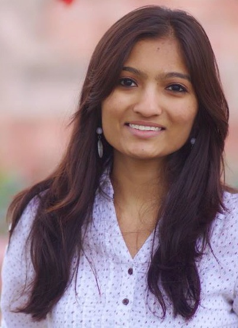

<!-- ### Aastha Mehta -->

### About

I am a PhD student at [Max Planck Institute for Software Systems (MPI-SWS)](http://www.mpi-sws.org/) and [University of Saarland (UdS)](http://cs.uni-saarland.de/). I work with [Peter Druschel](http://www.mpi-sws.org/~druschel/) and [Deepak Garg](http://www.mpi-sws.org/~dg/). Starting January 2021, I will be joining as a Tenure-Track Assistant Professor in the CS Department, University of British Columbia.

**I am hiring PhD students!**

### Research Interests

I am broadly interested in systems security, data privacy, operating systems, and distributed systems. I have worked on building [systems](http://thoth.mpi-sws.org/) that enable online services to comply with data privacy and usage policies, and prevent accidental disclosures due to bugs and misconfigurations. More recently, I have been working on solutions to ensure privacy of data in Cloud services in the face of network side-channel disclosures.

### Experience
- Research Intern, Microsoft Research Cambridge (UK) 
Jun 2015 - Aug 2015

- Member of Technical Staff, NetApp Bangalore (India) 
Jun 2011 - Aug 2012

- Intern, NetApp Bangalore (India) 
Jan 2011 - Jun 2011

- Summer Intern, MPI-SWS, Germany 
May 2010 - Jul 2010 

### Education
- Ph.D., Computer Science 
2012 - 2020 
Max Planck Institute for Software Systems (MPI-SWS), Germany 
Advisors: Peter Druschel, Deepak Garg

- B.E. (Hons.), Computer Science 
2007 - 2011 
Birla Institute of Technology and Science (BITS) Pilani, India 

### Publications
- Pacer: Network Side-Channel Mitigation in the Cloud [\[PDF\]](https://arxiv.org/pdf/1908.11568.pdf) [\[Poster\]](https://people.mpi-sws.org/~aasthakm/files/pacer_poster.pdf) 
**Aastha Mehta**, Mohamed Alzayat, Roberta De Viti, Björn B. Brandenburg, Peter Druschel, Deepak Garg 
Under Submission.

- Qapla: Policy compliance for database-backed systems [\[PDF\]](https://www.mpi-sws.org/~aasthakm/files/qapla.pdf) [\[Poster\]](https://www.mpi-sws.org/~aasthakm/files/qapla_poster.pdf) [\[Code\]](https://github.com/aasthakm/qapla) 
**Aastha Mehta**, Eslam Elnikety, Katura Harvey, Deepak Garg, Peter Druschel 
USENIX Security Symposium, 2017.

- Thoth: Comprehensive Policy Compliance in Data Retrieval Systems [\[PDF\]](http://www.mpi-sws.org/~elnikety/Eslam_Elnikety_Web_Page_files/sec16_paper_elnikety.pdf) 
Eslam Elnikety, **Aastha Mehta**, Anjo Vahldiek-Oberwagner, Deepak Garg, Peter Druschel 
USENIX Security Symposium, 2016.

- Oblivious Multi-Party Machine Learning on Trusted Processors [\[PDF\]](https://www.usenix.org/system/files/conference/usenixsecurity16/sec16_paper_ohrimenko.pdf) 
Olga Ohrimenko, Felix Schuster, Cédric Fournet, **Aastha Mehta**, Sebastian Nowozin, Kapil Vaswani, Manuel Costa 
USENIX Security Symposium, 2016.

- Guardat: Enforcing data policies at the storage layer [\[PDF\]](http://www.mpi-sws.org/~aasthakm/files/eurosys15-guardat.pdf) 
Anjo Vahldiek, Eslam Elnikety, **Aastha Mehta**, Deepak Garg, Peter Druschel, Ansley Post, Rodrigo Rodriguez, Johannes Gehrke 
European Conference on Computer Systems (EuroSys), 2015.

- HDFS Space Consolidation 
**Aastha Mehta**, Deepti Banka, Kartheek Muthyala, Priya Sehgal, Ajay Bakre 
Student Research Symposium, International Conference on High Performance Computing (HiPC), 2011.

### Teaching
- Instructor [CPSC 538M Topics in Security and Privacy](https://www.mpi-sws.org/~aasthakm/courses/cpsc538m.html) (UBC Graduate Seminar) 
Winter Term 2, Jan 2021

- Co-Instructor [Operating Systems](https://courses.mpi-sws.org/os-ws19/) (UdS Graduate Core Course) 
Winter 2019

- Teaching Assistant [Information Flow Control Systems](https://people.mpi-sws.org/~dg/teaching/ifcs2016/ifcs2016.html) (UdS Graduate Seminar) 
Summer 2016

- Teaching Assistant [Operating Systems](http://courses.mpi-sws.org/os-ss13/) (UdS Graduate Core Course) 
Summer 2013

### Service

**Program Committee**
- [EuroSys 2021](https://2021.eurosys.org/)
- [EuroDW 2021](https://2021.eurosys.org/workshops.html#workshops)
- [PriSC 2021](https://popl21.sigplan.org/home/prisc-2021)
- [Middleware Doctoral Symposium 2020](https://2020.middleware-conference.org/call-for-doctoral-symposium.html)
  
**Co-organizer**
- OSDI 2020 Mentoring Program

**Mentor**
- SOSP 2019 Mentoring Program

### Invited Talks & Presentations
**Policy Compliance in Online Services**
- School of Computing Science, Simon Fraser University. Feb 2020.
- Department of EECS, Oregon State University. Feb 2020.
- Department of Computer Science, Northwestern University. Feb 2020.
- Department of Computer Science, Duke University. Feb 2020.
- Department of Computer Science, George Mason University. Feb 2020.
- David R. Cheriton School of Computer Science, University of Waterloo. Mar 2020.
- Department of Computer Science, University of British Columbia. Mar 2020.
- Department of Computer Science, Washington University St. Louis. Mar 2020.
- Microsoft Research Redmond. Mar 2020.
- CISPA Helmholtz Center for Information Security. Mar 2020.
- IMDEA Software Institute. Apr 2020.
  
**Pacer: Network Side-Channel Mitigation in the Cloud**
- U of Maryland College Park (host: Bobby Bhattacharjee). May 2019.
- Cornell University (host: Lorenzo Alvisi). Nov 2018.
- Workshop on Speculative Side Channel Analysis [(WoSSCA)](https://conf.researchr.org/track/wossca-2018/wossca-2018-papers#program). Jul 2018.

**Qapla: Policy Compliance in Database-Backed Systems** 
USENIX Security. Aug 2017.

### Awards & Honors
- Selected for [Rising Stars Workshop in EECS](https://risingstars18-eecs.mit.edu/). Oct 2018.
- Selected for [Heidelberg Laureate Forum (HLF)](https://www.heidelberg-laureate-forum.org/event_2016/). My [Q&A with 6 out of 200](https://scilogs.spektrum.de/hlf/2499-2/) at HLF. Aug 2016.

### Contact
\<first name\>k\<last initial\>[AT]mpi-sws.org 
\<first name\>k\<last initial\>[AT]cs.ubc.ca

